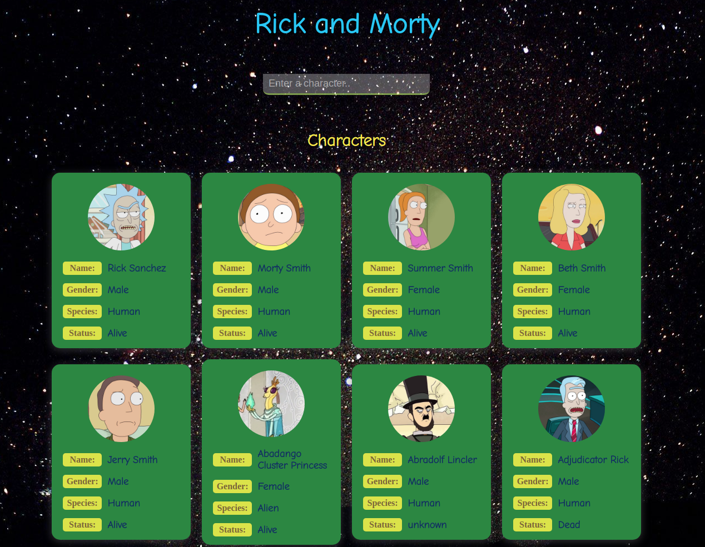

# RickandMortyAPI

For a couple of days I followed youtube tutorials for learning API and here I am trying on my own. It went good and I managed to make a project with API without looking anywhere.

[Click to see](https://ayerdelen.github.io/RickandMortyAPI)

